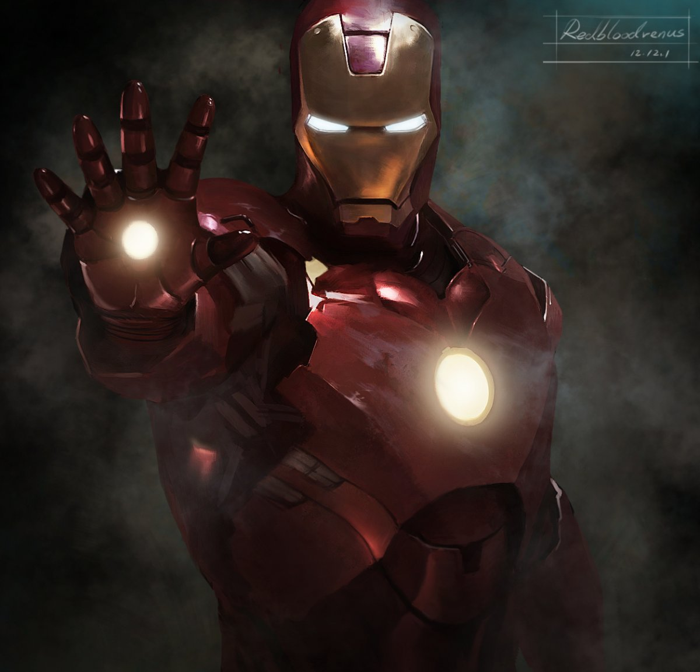

# Обо мне

### **Желе́зный челове́к** (англ. Iron Man); настоящее имя — Э́нтони Э́двард «То́ни» Старк (англ. Anthony Edward "Tony" Stark) — персонаж изданий Marvel Comics и их адаптаций, созданный писателем Стэном Ли, сценаристом Ларри Либером и художниками Доном Хекомruen и Джеком Кёрби; первое появление Железного человека состоялось в комиксе Tales of Suspense #39 в марте 1963 года.

## **Биография**

Сын богатого промышленника Говарда Старка, Тони был гениальным изобретателем и механиком. Он унаследовал бизнес отца в возрасте 21 года, превратив компанию в одного из лидирующих производителей оружия. Старк был ранен осколком в грудь во время полевого испытания на пригодность боевой брони, которая должна была наделить солдат боевыми способностями. Старка взял в плен оружейный барон Wong Chu, вынудив его создать оружие массового поражения — только тогда Тони получил бы операцию, необходимую для спасения его жизни.

Вместе со своим товарищем и бывшим пленным Хо Йинсеном, лауреатом Нобелевской премии по физике, Старк начал работать над модифицированным экзоскелетом, оснащённым тяжёлым вооружением. В секрете даже от Старка, Йинсен сконструировал защитную грудную пластинку для поддержания раненого сердца изобретателя. Старк надел костюм, чтобы попробовать сбежать из плена, но сам Профессор Йинсен был убит в решающей схватке. Он отдал свою жизнь, чтобы Железный человек смог жить.

Победив оружейного барона, Старк вернулся в Америку и переконструировал костюм. Выдумав историю, что Железный человек был его охранником, Старк вступил в двойную жизнь как миллиардер-изобретатель и костюмированный искатель приключений. Ранние враги посылали шпионов и иностранных агентов в намерении украсть броню Старка и его военные секреты. Спустя некоторое время Старк прекратил защищать только свои личные интересы. Он также стал заниматься вопросами национальной и международной безопасности. Железный человек даже помог основать Мстителей и стал спонсором их команды.

Несмотря на огромное богатство, жизнь Старка не безупречна. Начиная свою карьеру, он был вынужден все время носить нагрудную пластину, чтобы защитить своё сердце. Старк, к тому же, бывший алкоголик, и его личная жизнь — сплошной беспорядок. Во многих случаях, Железный человек — это освобождение и оболочка, которую он носит, чтобы держать окружающий мир в стороне.

Враги Железного человека принимали различные формы, от завоевателей с претензиями на мировое господство и корпоративных конкурентов до супер-преступников и иностранных агентов, стремившихся превзойти или украсть его технологии.

Старк рос, чувствуя возрастающую ответственность за использование его технологий по всему миру. Старк Интерпрайзис разорвало сотрудничество с правительством, сосредоточившись на технологиях, которые улучшат жизнь людей.

Наученный в молодости платить тем, кто помог ему жить столь комфортной жизнью, Старк основал множество благотворительных фондов и учреждений. С увеличивающимся чувством ответственности он достиг нового уровня взросления. Сравнивая свой секрет больше с долгом, чем с личным имуществом, Старк решился раскрыть миру, что он — Железный человек. С грузом двойной жизни на своих плечах Старк обнаружил себя на незнакомой территории как один из немногих публично известных героев.
Мы запускаем регистрацию на бетатестирование. Пожалуйста, напишите свои контакты на адрес [NeuroStartUp@nsu.io](mailto:NeuroStartUp@nsu.io).